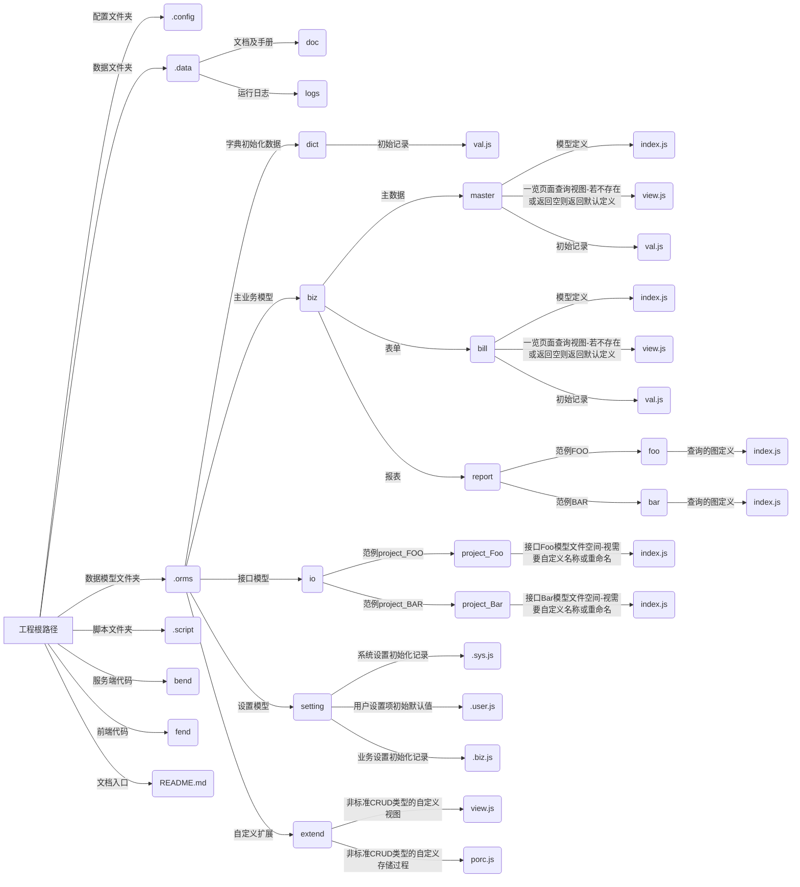
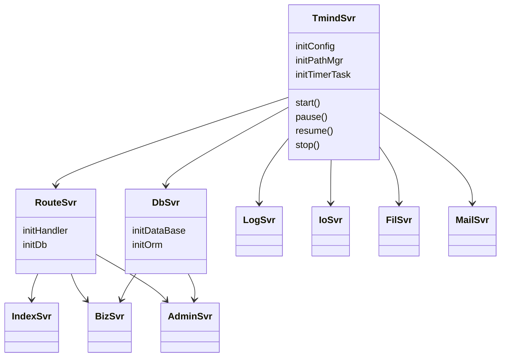
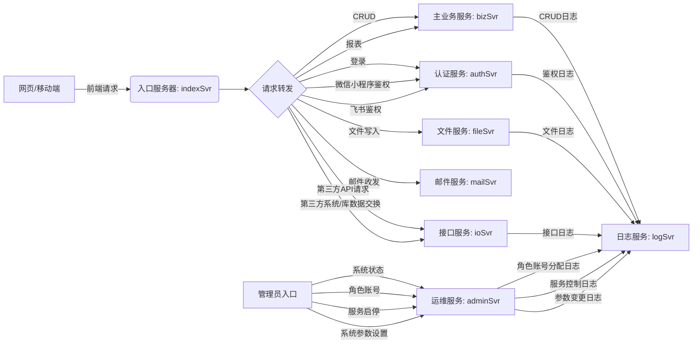
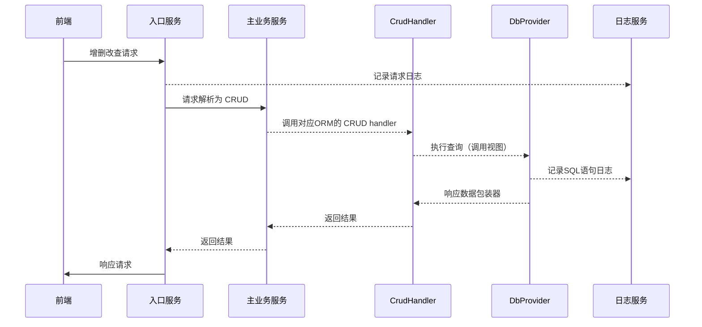
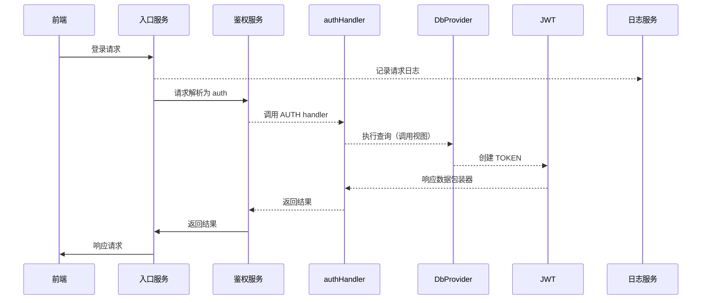

# 后端

## 启动

> ！请勿直接 node xxx.js 文件的方式启动。

	调用服务端脚本 start.js 或 dev.js 分别启动生产模式和开发模式，否则会导致 SvrBase 基类的 isDev 属性不正确，带来不可预知的错误。

## 环境

> 服务端内通过 process.env.NODE_ENV === dev 来区分是否处于开发模式，否则处于生产模式。

## 规范

> 命名

	服务端实例文件夹以 xxxSvr 格式为准，中间禁止任何符号，且必须以 Svr 结尾（大小写敏感）

## 配置文件

	配置文件采取全局工程配置模式，服务实例所在的文件夹名称，即为对应的配置文件名。

> 全局工程配置文件，文件路径： process.cwd()/../../.config，文件获取方式： Util/middleware/preReq
> ``` json

```
```
```

> 实例本地配置文件
> ```

```
```
```

> 配置文件会在服务端实例启动时自动识别实例名称，并加载

## 工程及实例文件夹结构

```
| 工程根路径
	|-- .config 	全局工程配置文件夹
	|-- .data	 	系统运行时数据位置，如日志文件
		|-- doc		文档
		|--	logs  运行日志
	|-- .orms	 	数据模型
		|--	dict 字典
			* val.js	初始记录（keepOrigin）
		|-- biz		主业务模型
			|--	master 主数据
				* index.js	模型定义文件
				* view.js		一览页面 SELECT 查询视图定义，若为 module.exports = ''，则初始化时自动创建默认视图
				* val.js	初始记录
			|--	bill 表单
				* index.js	模型定义文件
				* view.js		一览页面 SELECT 查询视图定义，若为 module.exports = ''，则初始化时自动创建默认视图
				* val.js	初始记录
			|--	report 报表
				foo
				* index.js		报表 foo 的视图 SELECT 查询视图定义（初始化时，会同步建立名为 proc_rpt_foo 的存储过程）
				bar
				* index.js		报表 bar 的视图 SELECT 查询视图定义（初始化时，会同步建立名为 proc_rpt_bar 的存储过程）
		|-- io  		接口模型
				|--	project_Foo 接口 Foo 模型文件空间（视需要自定义名称或重命名）
					|-- index.js
				|--	project_Bar 接口 Bar 模型文件空间（视需要自定义名称或重命名）
					|-- index.js
		|--	setting 设置
			* .sys.js	系统设置初始化记录
			* .user.js	用户设置项默认值
			* .biz.js	业务设置初始化记录
		|--	extend 自定义扩展
			* view	非标准 CRUD 类型的自定义视图
			* proc	非标准 CRUD 类型的自定义存储过程
	|-- .script	工程脚本，如 github 提交、服务启动、端口开放等
	|-- bend			后端服务文件夹
			|-- svrAdmin		管理员服务实例文件夹
			|--	svrAuth
	|-- fend 		前端项目文件夹
	|-- README.md
```



## 服务解构



## 服务职能



## CRUD 服务流



## 鉴权认证 服务流



## 数据模型

以 业务模型 Foo 为例，对于该模型，系统初始化时自动构建如下DB对象

> 容器

1. table（表）
   -- Foo
2. view（视图）
   -- view_Foo	(仅当 Foo 的 orm 定义 type = bill | master | report 时)
3. product（存储过程）
   --proc_bill_Foo	(仅当 Foo 的 orm 定义 type = bill 时，起内部值源来自 view_Foo)
   --proc_master_Foo	(仅当 Foo 的 orm 定义 type = master 时，起内部值源来自 view_Foo)
   --proc_report_Foo	(仅当 Foo 的 orm 定义 type = report 时，起内部值源来自 view_Foo)

> 操作

1. SELECT（bill）：采用请求函数 select * from proc_bill_foo(userId, pageIndex)，其中，userId 是前端发起请求的用户ID，pageIndex 是分页请求的页序索引，始于 0；
2. SELECT（master）：采用请求函数 select * from proc_master_foo(pageIndex)，其中，userId 是前端发起请求的用户ID，pageIndex 是分页请求的页序索引，始于 0；
3. SELECT（report）：采用请求函数 select * from proc_master_foo(userId)，其中，userId 是前端发起请求的用户ID，用于报表统计的数据权限（必须传入，但函数体内不一定采用）；
4. SELECT（dict）：服务启动时，会自动读取 __dict__ 表，并创建全局字典对象，请求时，直接读取并返回该对象（或JSON子节点）；
5. SELECT（setting - 系统级）：服务启动时，会自动读取 __sysSetting__ 表，并创建全局字典对象，请求时，直接读取并返回该对象（或JSON子节点）；
6. SELECT（setting - 系统级）：服务启动时，会自动读取 __sysSetting__ 表，并创建全局字典对象，请求时，直接读取并返回该对象（或JSON子节点）；

> 规则

1. 分页：系统固定每页数为 20 条记录。

> 扩展

1. 非通用 CRUD 的业务模型的视图或存储过程，存放于 .orms/extend 下，该文件夹下不再设任何子文件夹；
2. （约束规则）文件命名，以 view_ext_ 或 proc_ext_ 开头，同理，系统会强制将对应的视图或存储过程命名为 view_ext_或 proc_ext_ 开头（如果原本不是的话）；
3. （约束规则）如果该文件系视图，系统会强制采用 DROP VIEW IF EXISTS foo CASCADE; CREATE view foo... 重建的方式；
4. （约束规则）如果该文件系存储过程，系统会强制采用 CREATE OR REPLACE FUNCTION foo... 重建的方式；

> 接口

1. HTTP 请求类型 API，无需建立数据模型
2. 外部子系统（如外部系统 Bar）数据交换，接口数据模型存放于 .orms/io/project_Bar 下，其中，project_Bar 为示范命名，可自定义命名，该文件夹下不再区分 bill\master... 等类型，直接以业务模型名称（如 xxx）为文件名（如 xxx.js）

## 任务定时器

采用 node-schedule 库，其时间控制符使用 cron 风格记法，

```javascript
// 在主程序文件中，
const task = new Task(主程序配置, 任务函数或任务函数数组);
```

task 一旦被 new 以后，会自动开始定时执行，执行范围包括 new函数传参提供的任务函数，以及主程序所在路径的 @task 文件夹中的函数

> 定时器时间控制符
> ```
> 字符型：
> *		*		*		*		*		*
> T		T		T		T		T		T
> |				|				|
> |				|		|		L day of week (0 ~ 7) (0 or 7 is Sun)
> |				|		│____ month (1 ~ 12)
> |		|		│________ day of month (1 ~ 31)
> |		│____________ hour of day (0 ~ 23)
> |		│________________ minute of hour (0 ~ 59)
> │____________________ second of minute (0 ~ 59, OPTIONAL)

```
对象型：
	{
		second (0 ~ 59),
		minute (0 ~ 59),
		hour (0 ~ 23),
		date (1 ~ 31),
		month (0 ~ 11),
		year,
		dayOfWeek (0 ~ 6) Starting with Sunday,
		tz
	}
```
```

> task 外置文件

```
路径：主程序路径(app.js or app/index.js) 下的 @task/index.js，文件结构
``` javascirpt
// 任务定义可以是独立函数
module.exports = () => {
	......
};

// 或者函数数组
module.exports = [() => {...}, () => {....}];

// 或者带有独立时间定义的对象，其中，schedule 字段仅代表本函数的时间定义，func 代表要执行的任务函数
module.exports = {
	schedule: ...,
	func: () => {....}
}

// 或者以上类型混合的数组
module.exports = [
	// 任务一
	{
		schedule: ...,
		func: () => {....}
	},
	// 任务二
	{
		schedule: ...,
		func: () => {....}
	},
	... // 任务 ...N
	// 任务 N + 1
	() => {....}]
```
```

> 系统模型

* 信息系统

  创建者模型（增删改）

  订阅者模型（用户、事务、信息、通知）
* 事务系统

  业务维度解析（如订货业务、库存业务、物流业务）
* 策略系统 （促销策略、返利计算、统计分析）

与现存软件逻辑的区别：
例如，要做一个CRM系统，作为销售人员与客户保持联系、跟进和沟通的工具，成交客户需要知道为什么本次订单迟迟没有交付，销售人员需要到ERP/供应链系统中去查询，或者通过技术接口在 CRM 和 ERP 之间进行数据同步。（缺点：）；
又比如需要做一次市场活动，事先进行在线活动方案计划，需要读取产品库存（来源于ERP系统库存管理模块）、以及配合人员申请（成员信息来源于 HR）
以上场景，目前通用的做法是采取子系统独立管理自有数据，子系统间通过接口进行数据同步。
tFrame 模式，将以上场景分为两类，信息类和事务类。信息又分为创建者和订阅者。

分页查询每页输出数量：查询参数取值优先顺序（IDbProvider.IoptSelect.numInPage） > 服务配置（.config/.dbConf.js -> numInPage） > 系统内置默认值（20）

